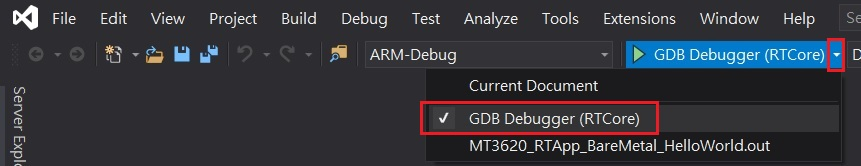
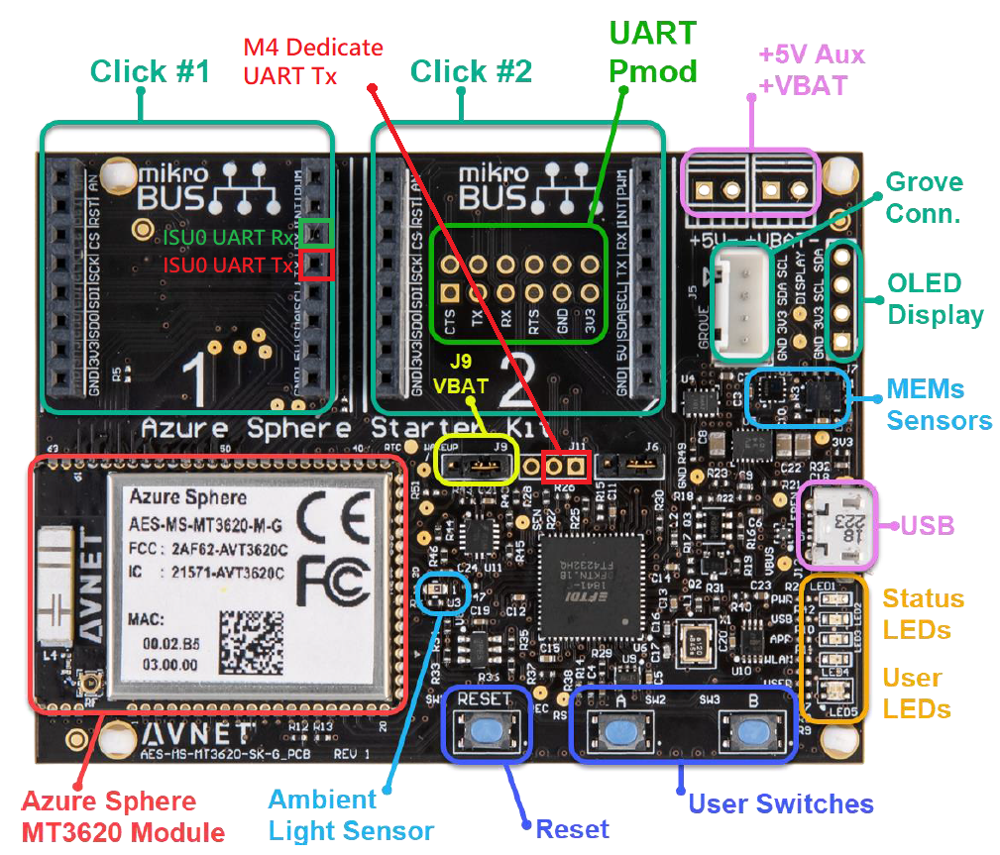
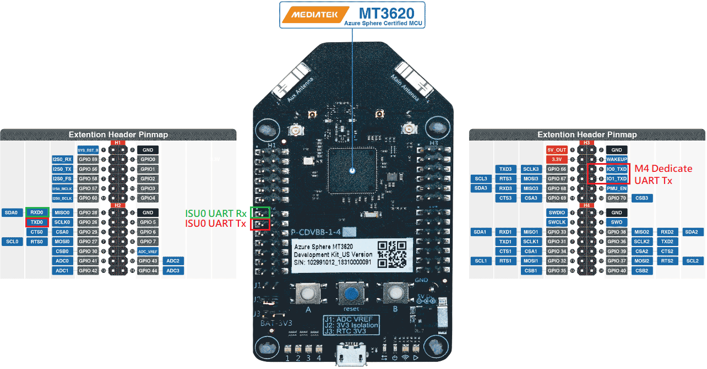

# Sample: MT3620 M4 real-time application - Bare Metal GPIO
### Description
This sample demonstrates how to use GPIO, GPT and UART on an MT3620 real-time core.  
- On-board LED_Red(GPIO8), LED_Green(GPIO9) and LED_Blue(GPIO10) are used as GPIO output.
- On-board Button_A(GPIO12) and Button_B(GPIO13) are used as GPIO input.
- GPT0 is used for LED_Green blinking.
- GPT3 is used for motitoring Button_A and Button_B status.
- ISU0 UART interface is used to print the output log.
- User could press Button_A to turn on LED_Blue, and release to turn off.
- User could press Button_B to turn on LED_Red, and release to turn off.  
(Note, UART port number in main.c could be changed from **OS_HAL_UART_ISU0** to **OS_HAL_UART_PORT0** to use M4 dedicate UART port.)  
Please refer to the [MT3620 M4 API Rerference Manual](https://support.mediatek.com/AzureSphere/mt3620/M4_API_Reference_Manual) for the detailed API description.

### Prerequisites
* **Hardware**
    * [AVNET MT3620 Starter Kit](https://www.avnet.com/shop/us/products/avnet-engineering-services/aes-ms-mt3620-sk-g-3074457345636825680/) or [Seeed MT3620 Development Kit](https://www.seeedstudio.com/Azure-Sphere-MT3620-Development-Kit-US-Version-p-3052.html)
* **Software**
    * Refer to [Azure Sphere software installation guide](https://docs.microsoft.com/en-ca/azure-sphere/install/overview).
    * A terminal emulator (such as Telnet or [PuTTY](https://www.chiark.greenend.org.uk/~sgtatham/putty/) to display the output log).

### How to build and run the sample
1. Start Visual Studio.  
2. From **File** menu, select **Open > CMake...** and navigate to the folder that contains this sample.  
3. Select **CMakeList.txt** and then click **Open**.  
4. Wait few seconds until Visual Studio finish create the project files.
5. From **Build** menu, select **Build ALL (Ctrl+Shift+B)**.  
6. Click **Select Start Item** and then select **GDB Debugger (RTCore)** as following.  
    
7. Press **F5** to start the application with debugging.  

### Hardware configuration
* [AVNET MT3620 Starter Kit](https://www.avnet.com/shop/us/products/avnet-engineering-services/aes-ms-mt3620-sk-g-3074457345636825680/)
    * Connect PC UART Rx to AVNET MT3620 Starter Kit Click #1 TX (ISU0_UART_TX):
        
* [Seeed MT3620 Development Kit](https://www.seeedstudio.com/Azure-Sphere-MT3620-Development-Kit-US-Version-p-3052.html)
    * Connect PC UART Rx to Seeed MT3620 Development Kit GPIO 26 / TXD0  (ISU0_UART_TX)
        
