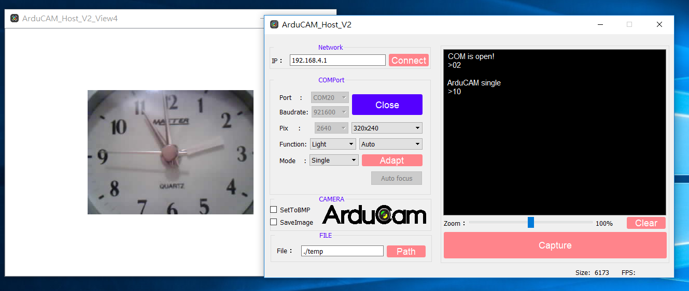
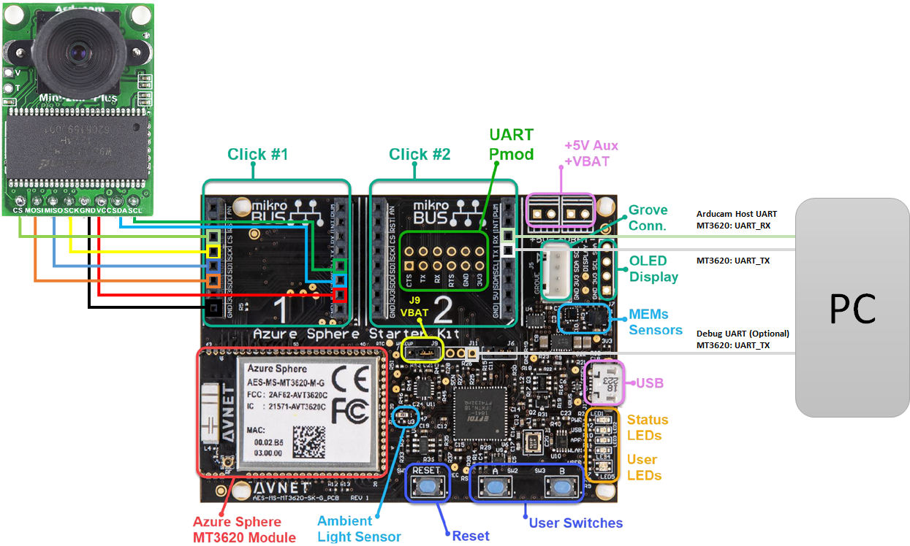
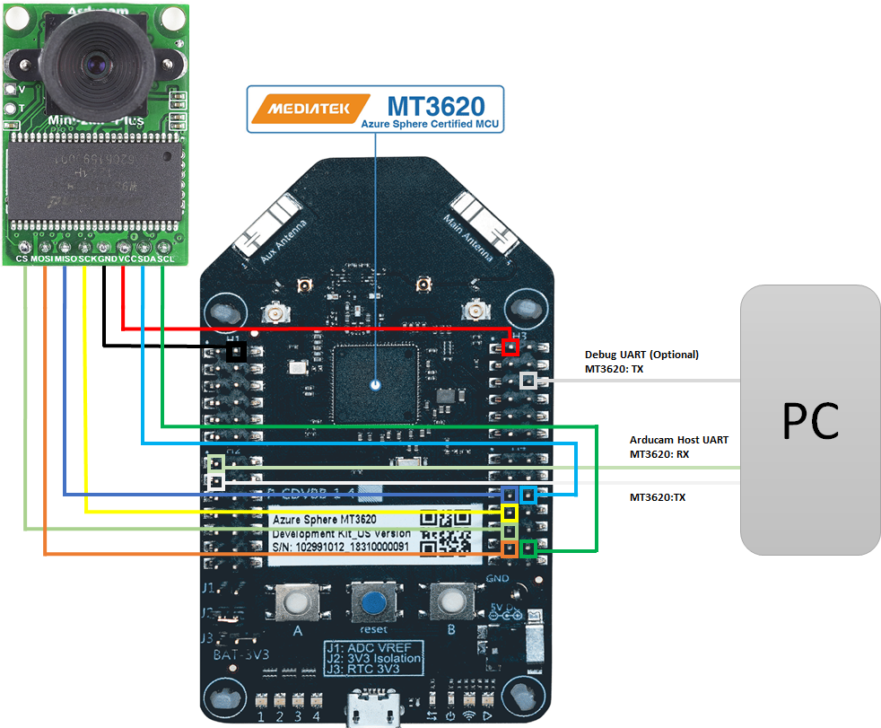

# Sample: MT3620 M4 real-time application - FreeRTOS Arducam
### Description
This sample demonstrates how to control Arducam on an MT3620 real-time core.  
- M4 dedicate UART interface is used to print the output log.  
- ISU0 UART interface is used to communicate with Arducam Host APP on PC.
- ISU1 SPI interface is used to receive image data from Arducam.
- ISU2 I2C interface is used to configure Arducam.
- On-board button_A is used to trigger Arducam "single capture".
- On-board button_B is used to trigger Arducam "continuous capture".
- Arducam host APP V2 executed on Windows PC is used to display the image data.  
Please refer to the [MT3620 M4 API Reference Manual](https://support.mediatek.com/AzureSphere/mt3620/M4_API_Reference_Manual) for the detailed API description.

### Prerequisites
* **Hardware**
    * [Arducam 2MP OV2640 Mini Camera Module](https://www.arducam.com/product/arducam-2mp-spi-camera-b0067-arduino/)
    * [AVNET MT3620 Starter Kit](https://www.avnet.com/shop/us/products/avnet-engineering-services/aes-ms-mt3620-sk-g-3074457345636825680/) or [Seeed MT3620 Development Kit](https://www.seeedstudio.com/Azure-Sphere-MT3620-Development-Kit-US-Version-p-3052.html)
* **Software**
    * Refer to [Azure Sphere software installation guide](https://docs.microsoft.com/en-ca/azure-sphere/install/overview).
    * A terminal emulator (such as Telnet or [PuTTY](https://www.chiark.greenend.org.uk/~sgtatham/putty/) to display the output log).
    * [Arducam host APP V2](https://github.com/ArduCAM/Arduino/tree/master/ArduCAM/examples/host_app/ArduCAM_Host_V2.0_Windows)

### How to build and run the sample
1. Start Visual Studio.  
2. From **File** menu, select **Open > CMake...** and navigate to the folder that contains this sample.  
3. Select **CMakeList.txt** and then click **Open**.  
4. Wait few seconds until Visual Studio finishes creating the project files.
5. From **Build** menu, select **Build ALL (Ctrl+Shift+B)**.  
6. Click **Select Start Item** and then select **GDB Debugger (RTCore)** as following.  
    
7. Press **F5** to start the application with debugging.  
8. Run Arducam host APP V2.
9. Select the correct COM port and click "Open".
10. Click "Capture" and check image data:
    

### Hardware configuration
* [AVNET MT3620 Starter Kit](https://www.avnet.com/shop/us/products/avnet-engineering-services/aes-ms-mt3620-sk-g-3074457345636825680/)
    * Connect Arducam:
        
* [Seeed MT3620 Development Kit](https://www.seeedstudio.com/Azure-Sphere-MT3620-Development-Kit-US-Version-p-3052.html)
    * Connect Arducam:
        
